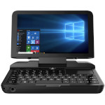

# GPD MicroPC

  
|Component|Description                                                    |
|---------|---------------------------------------------------------------|
|CPU      |Intel Celeron N4100                                            |
|GPU      |Intel UHD Graphics 600                                         |
|RAM      |8GB                                                            |
|Storage  |128GB M.2 SSD                                                  |
|Screen   |6.0" 1280×720                                                  |
|Keyboard |6 Rows QWERTY                                                  |
|Slot     |MicroSD                                                        |
|LAN      |10/100/1000Mbps                                                |
|WLAN     |Wi-Fi 802.11 a/b/g/n/ac                                        |
|USB      |Type-C x 1、Type-A x 3                                         |
|Bluetooth|v4.2                                                           |
|Battery  |7.4V 3100mA                                                    |
|Dimension|153mm × 113mm × 23.5mm                                         |
|Weight   |440g                                                           |
|Others   |Touchpad、RS232、HDMI                                          |

### https://steward-fu.github.io/website/index.htm
